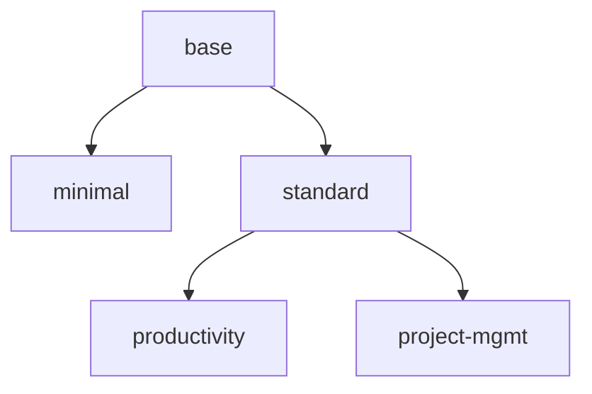

<!-- AUTO-GENERATED - Do not edit manually -->

> **AUTO-GENERATED - Do not edit manually**

Regenerate: `python tools/generate_profile_docs.py`

---

# Profiles index

This page shows profile inheritance and links to individual profile pages.

## Graph

## Profiles

- [base](base/README.md)
  - [minimal](minimal/README.md)
  - [standard](standard/README.md)
    - [productivity](productivity/README.md)
    - [project-mgmt](project-mgmt/README.md)
